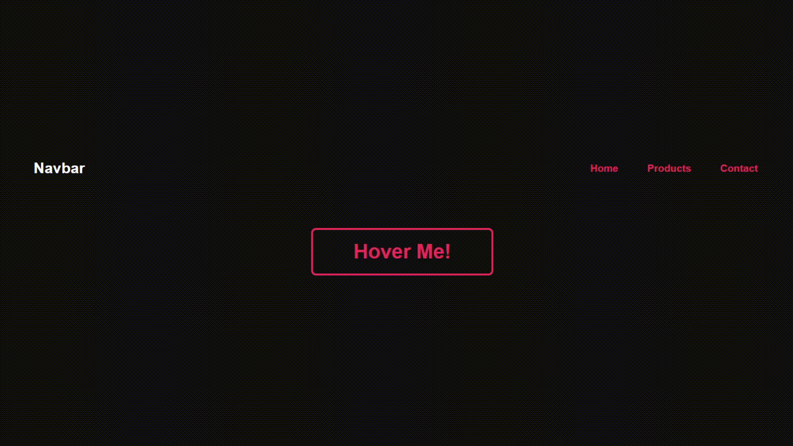
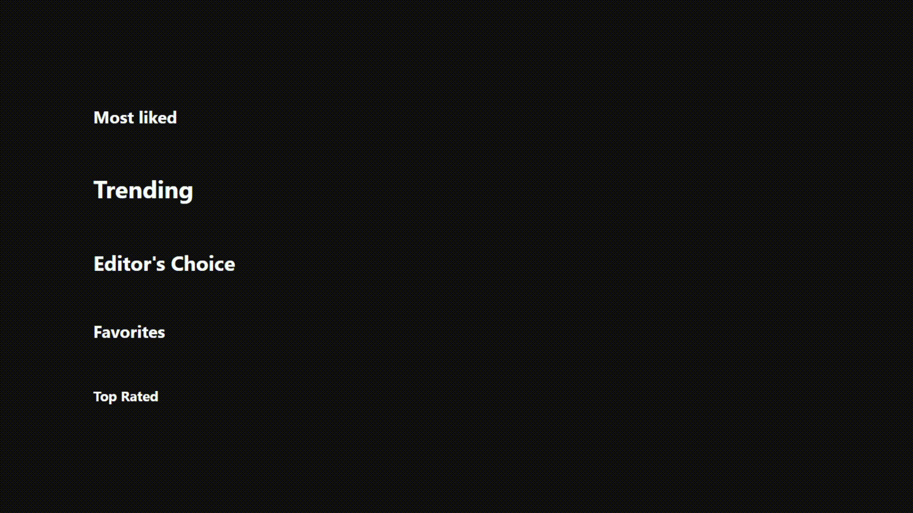

# Just some CSS Effects and Buttons

## Usage or License
Feel free to use for any purpose as desired.

## Illustrations
Click titles for link to source code.

1. ### [Popout Edges on Hover Button](popout-edges)
    Uses only HTML and CSS
    
    

2. ### ["Explore More" popup on Headings](explore-more-popup)
    Uses only HTML and CSS. Transition is happening on width so there might be some performance costs.

    

3. ### [Destiny 2 Button](destiny2-button)
    Uses only HTML and CSS. Button has `backdrop-filter` for blur effect and which don't have support on Firefox. Read more on https://caniuse.com/?search=backdrop-filter

    